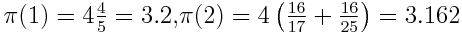

# PRACE

## Summer Of HPC Code Test

This repositry is a collection of notebooks and files used to solve the 2017
PRACE Summer of HPC Code Test. Although I am not eligable to take part, I found
the programming exercise quite interesting and a nice scientific computing
problem to solve, so here are my solutions.

*All Python code has been written in >=3.5*

## The Problem

The following expansion gives an approximation to the exact value of π:

We can check this by hand like so...

It can be shown that the approximation continues to become more accurate as N is
increased. Note that you must use double-precision variables for ALL floating-point
numbers.

### Exercise 1

Write a program in C, C++, Fortran or Java that computes an approximation to π
using the above formula for the following values of N: 1, 2, 10, 50, 100, 500.
For each value of N, print out the approximate value π(N) and the error err(N).
The error is the difference between π(N) and the true value of π, ie err(N) =
π(N) − π. As N increases the value of the error should decrease.

### Exercise 2

We now want to find out the minimum value of N that is required to give a value
for π(N) that is accurate to some specified value. We will call this value Nmin.
By computing π(N) for increasing values of N, calculate Nmin such that err(Nmin)
`< 10^−6`

### Exercise 3

This way of computing Nmin is clearly inefficient. For example, if we require
err(Nmin) `< 10^−6`. and we calculate err(2) = 0.02, it is a waste of time to
calculate err(3) as it is already obvious that Nmin is very much larger than 2!

Rewrite your program so that is uses a more efficient way to locate the minimum
value of N. Your new method must produce exactly the same value for Nmin as
before but should be faster. For example, you might try and reduce the number of
times that you have to evaluate err(N). You should also tell us how much faster
your new program is.

